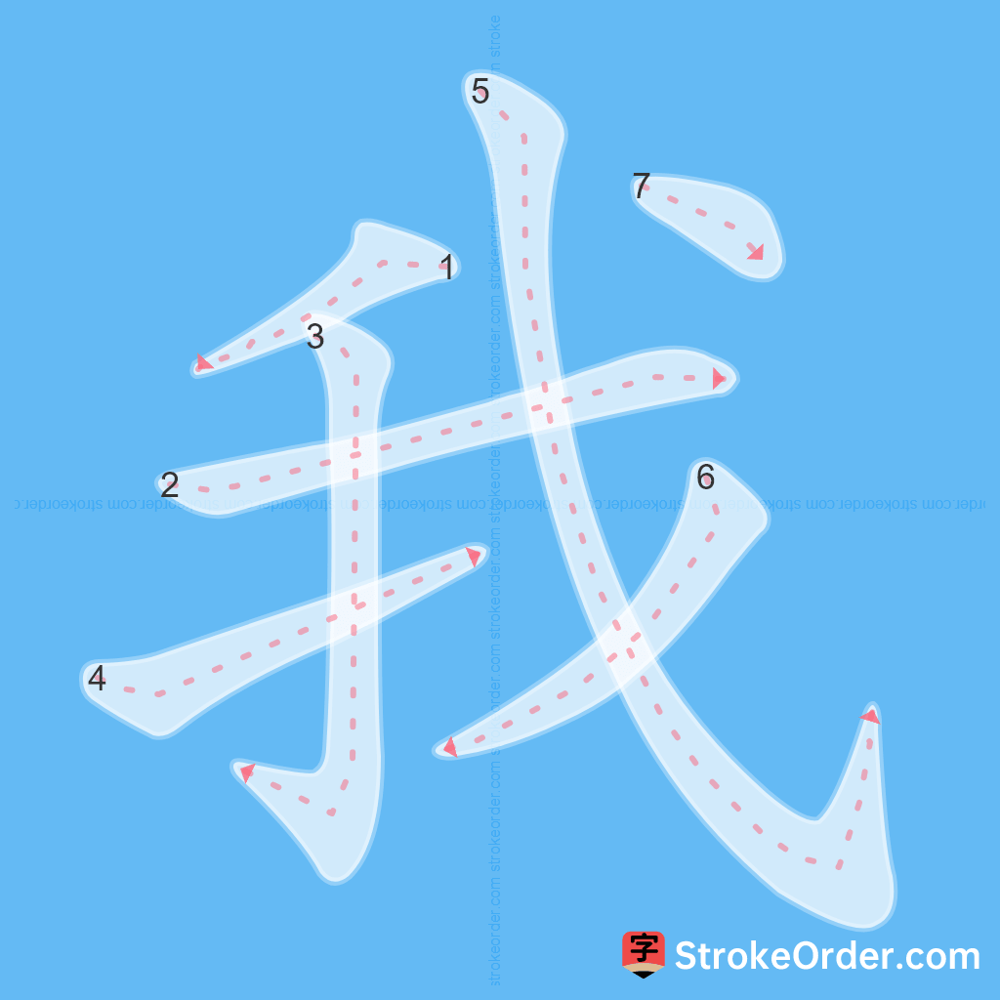
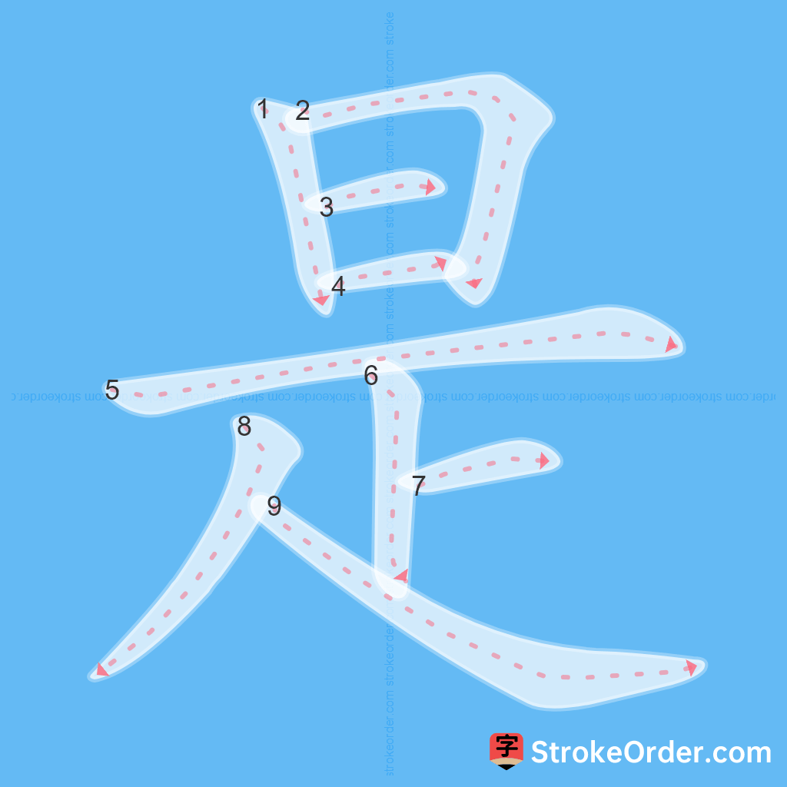
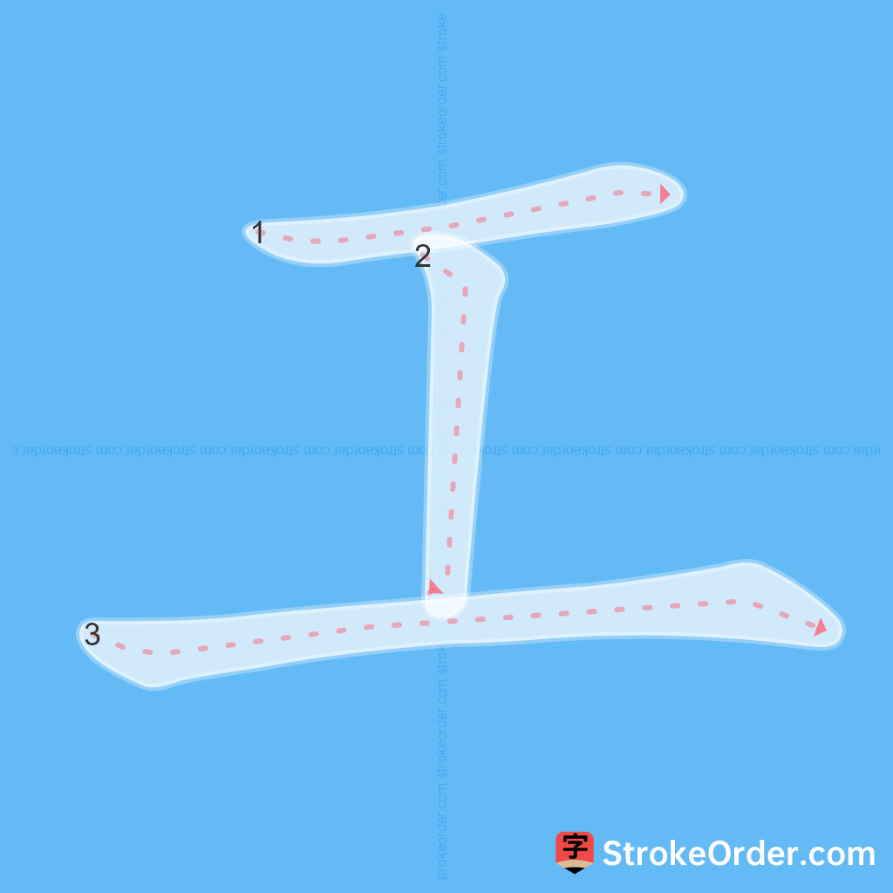

# VOCABULARY

## L1-1 Giới thiệu bản thân

### Từ vựng 1

#### **1. Core Vocabulary (Từ vựng cơ bản)**

| Character (Hán tự) | Pinyin | Part of Speech | Vietnamese Meaning                           |
| ------------------ | ------ | -------------- | -------------------------------------------- |
| **你**             | nǐ     | Đại từ         | bạn, anh, chị, ông, bà...                    |
| **好**             | hǎo    | Tính từ        | tốt, lành, hay                               |
| **我**             | wǒ     | Đại từ         | tôi, tao, tớ, ta, mình... (tự xưng bản thân) |
| **叫**             | jiào   | Động từ        | là, gọi là                                   |

---

#### **2. Common Phrases & Sentences (Cụm từ và Câu thông dụng)**

**Greetings (Chào hỏi):**

- <button onclick="speakNormal('你好')">**你好！** (Nǐ hǎo!)</button>
- _Vietnamese:_ Xin chào!

**Introductions (Giới thiệu tên):**

- <button onclick="speakNormal('我叫姚明')">**我叫姚明。** (Wǒ jiào Yáo Míng.)</button>
- _Vietnamese:_ Tôi tên là Diêu Minh.

- <button onclick="speakNormal('我叫王一山')">**我叫王一山。** (Wǒ jiào Wáng Yīshān.)</button>
- _Vietnamese:_ Tôi tên là Vương Nhất Sơn.

- <button onclick="speakNormal('你叫李明')">**你叫李明。** (Nǐ jiào Lǐ Míng.)</button>
- _Vietnamese:_ Bạn tên là Lý Minh.

- <button onclick="speakNormal('我叫肖明')">**我叫肖明。** (Wǒ jiào Xiǎo Míng.)</button>
- _Vietnamese:_ Tôi tên là Tiêu Minh.

---

#### **3. Combined Example (Ví dụ tổng hợp)**

- <button onclick="speakNormal('你好！我叫姚明')">**你好！我叫姚明。**</button>
- _Pinyin:_ Nǐ hǎo! Wǒ jiào Yáo Míng.
- _Vietnamese:_ Xin chào! Tôi tên là Diêu Minh.

---

### Từ vựng 2

#### Core Vocabulary (Từ vựng cơ bản)

| Character (Hán tự)                                        | Pinyin       | Part of Speech | Vietnamese Meaning |
| --------------------------------------------------------- | ------------ | -------------- | ------------------ |
| <button onclick="speakSlow('是')">**是**</button>         | shì          | Động từ (Verb) | là                 |
| <button onclick="speakSlow('学生')">**学生**</button>     | xuéshēng     | Danh từ (Noun) | học sinh           |
| <button onclick="speakSlow('工程师')">**工程师**</button> | gōngchéngshī | Danh từ (Noun) | kỹ sư              |

---

#### Sentences (Câu)

##### Identifying as a Student (Xác định là học sinh)

- <button onclick="speakNormal('王明是学生')">**王明是学生。** (Wáng Míng shì xuéshēng.)</button>
- Vương Minh là học sinh.

- <button onclick="speakNormal('我叫王明，我是学生')">**我叫王明，我是学生。** (Wǒ jiào Wáng Míng, wǒ shì xuéshēng.)</button>
- Tôi tên là Vương Minh, tôi là học sinh.

##### Identifying as an Engineer (Xác định là kỹ sư)

- <button onclick="speakNormal('我是工程师')">**我是工程师。** (Wǒ shì gōngchéngshī.)</button>
- Tôi là kỹ sư.

- <button onclick="speakNormal('李明是工程师')">**李明是工程师。** (Lǐ Míng shì gōngchéngshī.)</button>
- Lý Minh là kỹ sư.

- <button onclick="speakNormal('赵阳是工程师')">**赵阳是工程师。** (Zhào Yáng shì gōngchéngshī.)</button>
- Triệu Dương là kỹ sư.

## L1-2 Hỏi về nghề nghiệp
