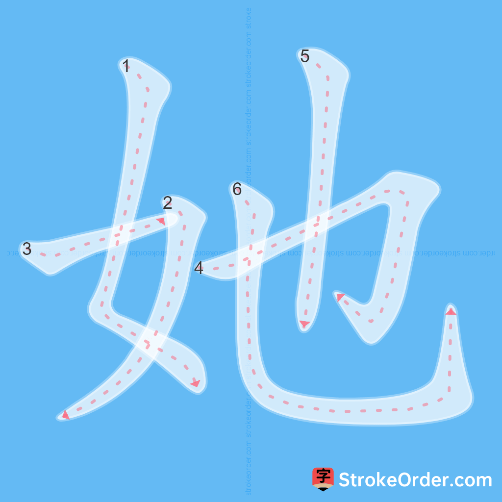
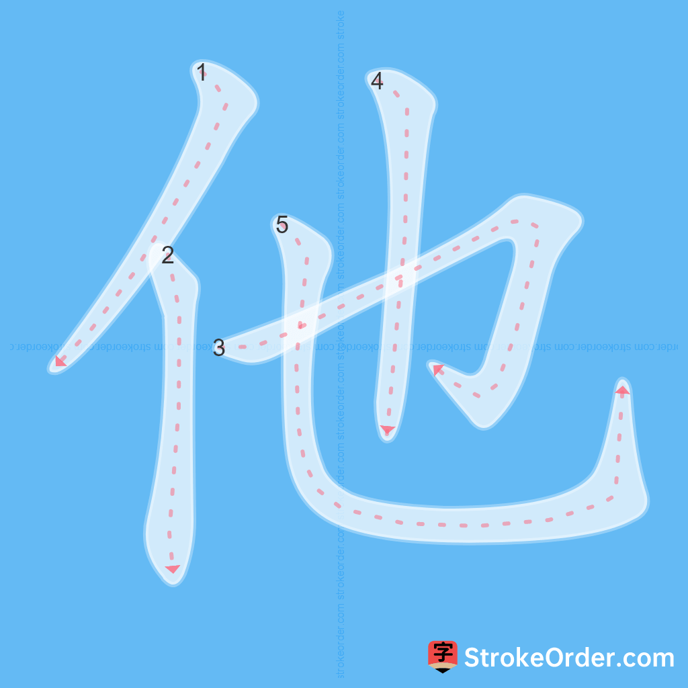
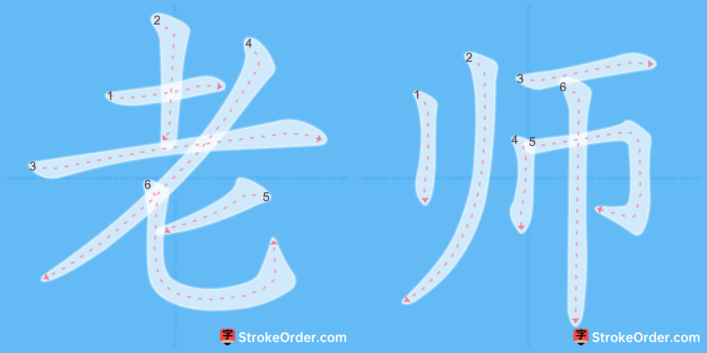
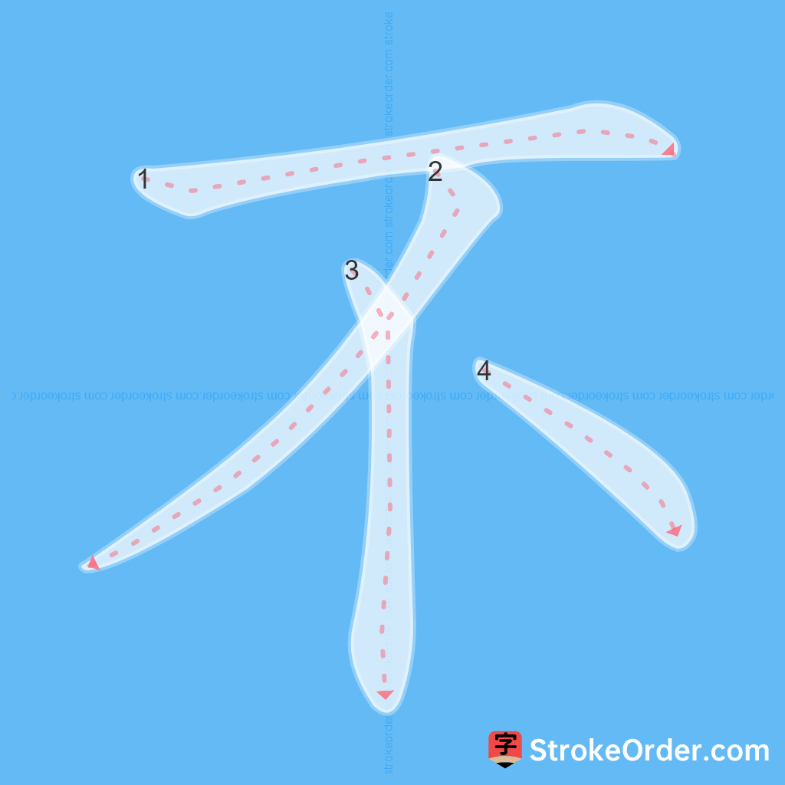

# VOCABULARY

## **Lesson Overview: L1-2 Hỏi về nghề nghiệp (Asking about Occupations)**

### **Key Vocabulary (Từ vựng quan trọng)**

Characters: **她，他，老师，不**

---

### **Vocabulary Details**

| Character | Pinyin | Vietnamese Meaning | Grammatical Note |
| --- | --- | --- | --- |
| <button onclick="speakSlow('她')">**她**</button> | tā | cô ấy, chị ấy, bà ấy... | Đại từ (Pronoun) - Chỉ nữ giới |
| <button onclick="speakSlow('他')">**他**</button> | tā | anh ấy, hắn, người ấy, nó... | Đại từ (Pronoun) - Chỉ nam giới |
| <button onclick="speakSlow('老师')">**老师**</button> | lǎoshī | giáo viên, thầy cô giáo | Danh từ (Noun) |
| <button onclick="speakSlow('不')">**不**</button> | bù | không (dùng trước động từ, tính từ...) | Phó từ (Adverb) - Biểu thị sự phủ định |

> **Mẹo nhỏ (Small Tip):**
> Trong tiếng Trung, “**他**” và “**她**” đều phát âm là “**tā**”.
> * “**他**” (tā) có bộ nhân đứng “**亻**”, chỉ nam giới.
> * “**她**” (tā) có bộ nữ “**女**”, chỉ nữ giới.

> **Mẹo nhỏ về biến điệu (Tone Change Tip):**
> * Khi "**不** (bù)" đứng trước âm tiết mang **thanh 4**, nó đổi thành **thanh 2** (bú). Ví dụ: 不会 (bú huì), 不看 (bú kàn).
> * Khi đứng trước các thanh 1, thanh 2, và thanh 3, nó vẫn giữ nguyên là **bù**.

---

### **Example Sentences & Practice**

**1. Occupations**

* <button onclick="speakNormal('她叫王丽丽。')">**她叫王丽丽。**</button>
    * *Pinyin:* Tā jiào Wáng Lìlì.
    * *Translation:* Cô ấy tên là Vương Lệ Lệ.

* <button onclick="speakNormal('她是学生。')">**她是学生。**</button>
    * *Pinyin:* Tā shì xuésheng.
    * *Translation:* Cô ấy là học sinh.

* <button onclick="speakNormal('他叫姚明。')">**他叫姚明。**</button>
    * *Pinyin:* Tā jiào Yáo Míng.
    * *Translation:* Anh ấy tên là Diêu Minh.

* <button onclick="speakNormal('他是工程师。')">**他是工程师。**</button>
    * *Pinyin:* Tā shì gōngchéngshī.
    * *Translation:* Anh ấy là kỹ sư.

**2. Negative Sentences (Phủ định)**

* <button onclick="speakNormal('她不叫丽丽。')">**她不叫丽丽。**</button> (Tā bù jiào Lìlì.) — Tên cô ấy không phải là Lệ Lệ.
* <button onclick="speakNormal('他不是学生。')">**他不是学生。**</button> (Tā bú shì xuésheng.) — Cậu ấy không phải học sinh.
* *Note: "shì" is tone 4, so "bù" changes to "bú".*

**3. Formal Greetings & Occupations**

* <button onclick="speakNormal('王老师，你好！')">**王老师，你好！**</button> (Wáng lǎoshī, nǐ hǎo!) — Em chào cô Vương ạ!
* <button onclick="speakNormal('她是老师。')">**她是老师。**</button> (Tā shì lǎoshī.) — Cô ấy là giáo viên.

---

